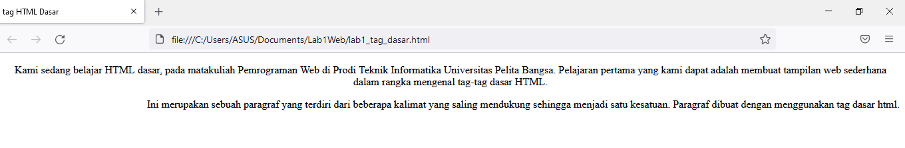

# Lab1Web
## Tugas Pertemuan 2 - Pemrograman Web

 
 Nama : Moch. Nauval faris muzaki  
 NIM : 312010122  
 Kelas : TI.20.B1  
 Mata Kuliah : Bahasa Pemrograman

*Untuk pertemuan  ke 2 ini saya akan membahas tentang perintah pada HTML*

- Menampilkan title HTML pada browser  

 

 1. **Membat paragraf**

  Disini membuat paragraf pada file HTML pada sintax p untuk membuat paragraf baru. dibawah ini untuk tampilannya

 
 - **Perataan Paragraf**
  
 Disini kita akan merubah perataan pargraf dari pinggir menjadi ke tengah agar lebih rapih. berikut tampilannya

 

 - **Membuat Judul Baru**

  
untuk selanjutnya kita memasukan Judul Baru pada HTML ini. Berikut tampilannya

- **Memformat teks**

 
Agar teks terilihat lebih menarik kita memodifikasi jadi disini kita membuat beberapa teks menjadi tebal dan miring. berikut tampilannya

- **Menyisipkan Gambar**

 
Disini kita menyisipkan gambar untuk logo atau apapun disini saya meyisipkan logo kampus UPB. berikut tampilannya

- **Membuat Hyperlink**

 
tujuan membuat hyper link ini agar kita dapat membuat halaman baru. berikut tampilannya

